# PokeCenter

PokeCenter is a responsive single-page Angular application that lets users **browse, search, and view detailed information about Pokémon**. Built with modern Angular best practices, it demonstrates component-based architecture, RxJS for async data handling, and responsive design.  

## Features
- Browse Pokémon list with filters by type, generation, name  
- Global Search Pokémon by name  
- View detailed stats, types, images, and other details  
- Team Builder that helps users form competitive teams  
- Trainer Guides that help users with information about Natures, Abilities, EVs & IVs  
- Pokedex Tracker that helps users keep track of Pokémon they caught in games  
- Responsive UI for desktop and mobile  
- Modular Angular components and services  
- Async data handling with RxJS Observables  
- Dynamic routing using Angular Router  

## Technologies Used
- Angular 20.0.4  
- TypeScript  
- RxJS  
- HTML / CSS  
- Chart.js
- REST APIs (PokéAPI)  

## Screenshots
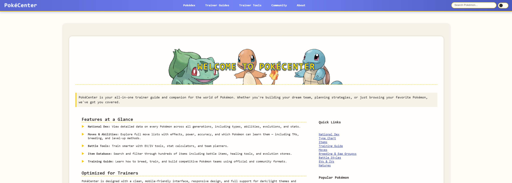
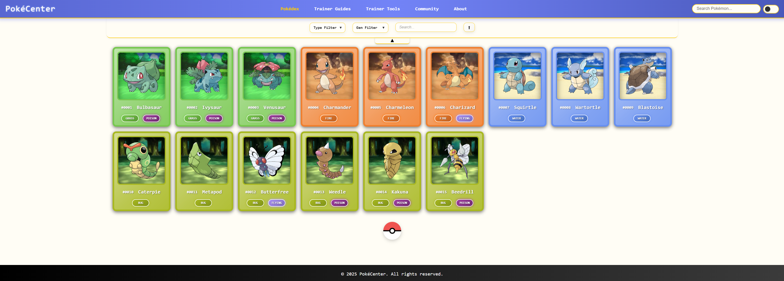
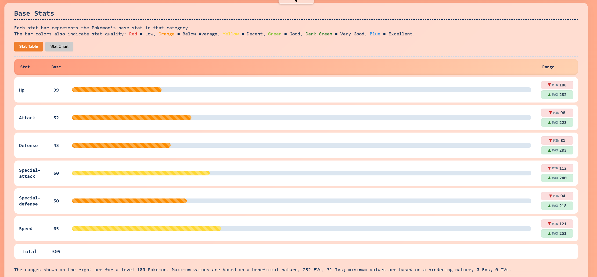
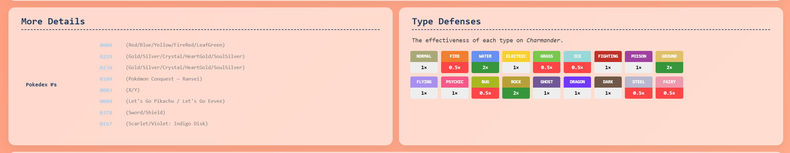
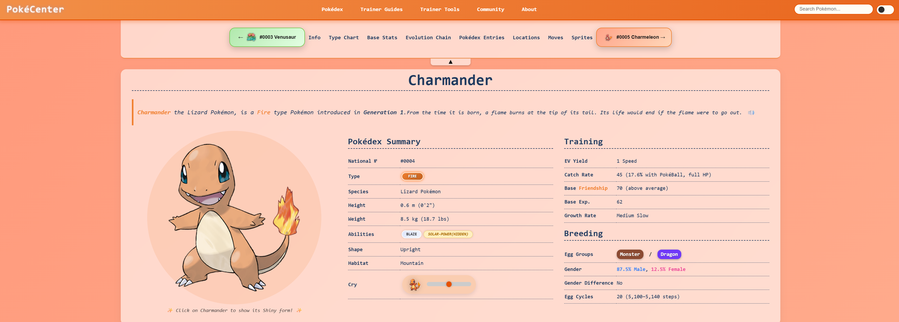
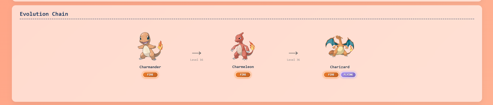
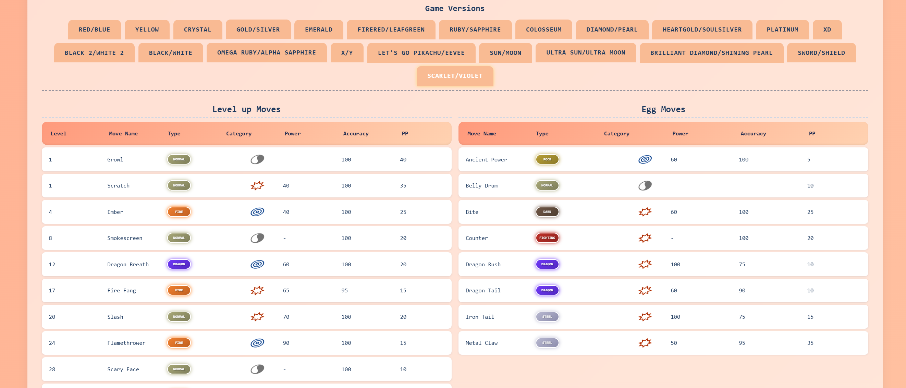
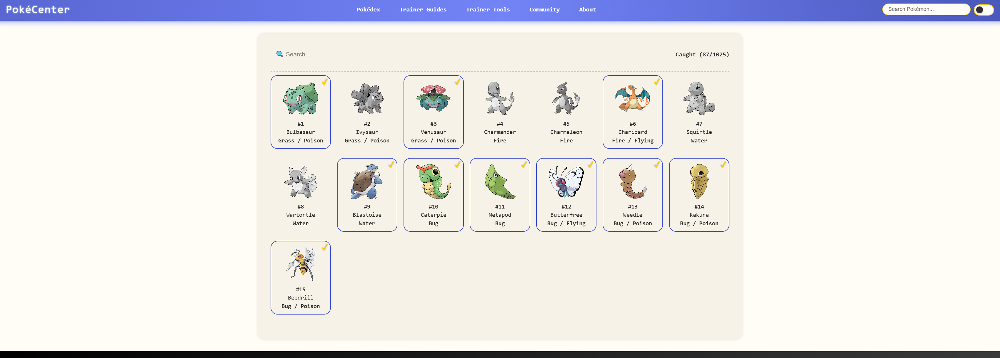
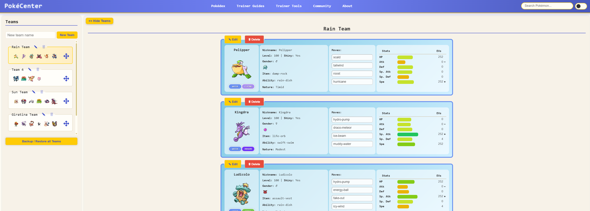
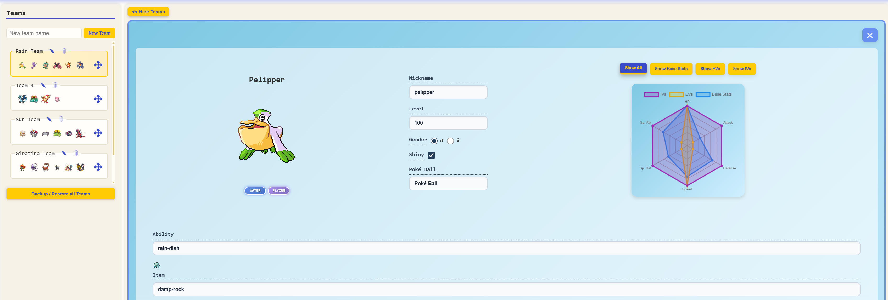
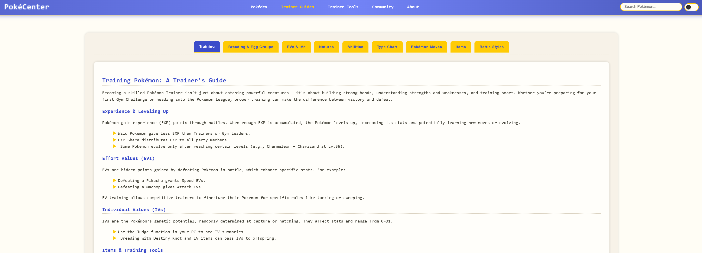


## Getting Started

### Prerequisites
- Node.js and npm installed on your computer..  
- Angular CLI installed globally (`npm install -g @angular/cli`)  

### Installation & Running Locally
```bash
# Clone the repository
git clone https://github.com/ibrahimitani0/pokecenter.git

# Navigate into the project folder
cd pokecenter

# Install dependencies
npm install

# Run the development server
ng serve

# Open your browser at:
http://localhost:4200/